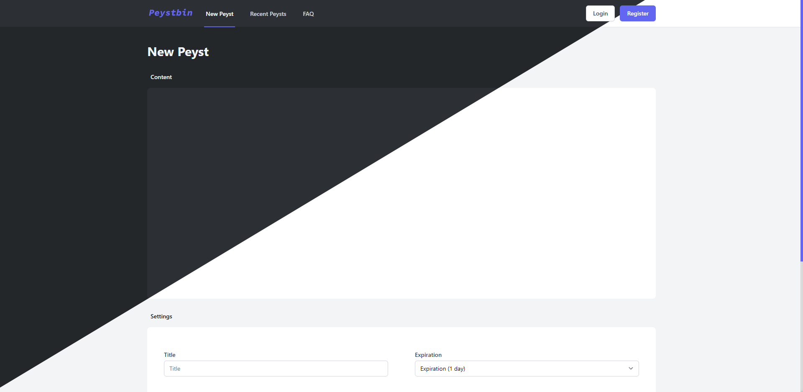

# :clipboard: Peystbin
A Text Storage Site.

<p align="center">
  
</p>

## Project setup
```
npm install
```


### Compiles and minifies for production
```
npm run build
```


### Run server
```
mv move_to_dist/* ./dist
```
```
cd dist
```
```
php -S localhost:80
```


#### Configure files
`backend\config\config.php`
`src\config.ts`
